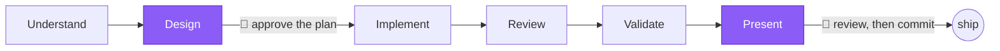

<div align="center">

# 🛠️ Engineering Framework

### A senior engineering workflow for Claude Code — on any stack, in any repository.

```text
Understand → Design → Human approval → Implement → Review → Validate → Present
```

**Understand broadly enough to be right. Build only what the requirement needs.**
Evidence over assumption · risk-based rigor · explicit human approval · independent review.

<br/>

[](LICENSE)
[](https://claude.com/claude-code)
[](#-what-it-does-not-do)
[](#-what-it-does-not-do)
[](#-what-ships)

<br/>

[**Install**](#-getting-started) · [**Use**](#-use) · [**Risk tiers**](#-risk-decides-the-rigor) · [**What ships**](#-what-ships) · [**Docs**](#-documentation)

</div>

---

The plugin supplies the **methodology**. Your `CLAUDE.md` supplies the **facts**
about your system. Agents cite your code or say `UNKNOWN` — they never guess
your stack, and they never invent an architecture you don't have.



> The pipeline runs on its own and **stops exactly twice** — to approve the
> plan, and to review the diff before you commit. Everything else runs without
> asking, at the rigor the change's risk earns.

---

## 🚀 Getting started

Two independent things must be in place. One lives on **your machine**; the
other lives in the **repository**.

| | Lives in | Arrives via |
|---|---|---|
| **The plugin** | `~/.claude/` on your machine | You install it. `git pull` never brings it. |
| **The repository declaration** (`.claude/settings.json`, `CLAUDE.md`) | The repository | `git pull`. One person ran `framework-install`. |

| Your situation | Do this |
|---|---|
| 🆕 Nothing set up yet | [1](#1-install-the-plugin-once-per-machine) then [2](#2-set-up-a-repository-once-per-repository) |
| 🤝 Teammate already set up the repo | [3](#3-join-a-repository-thats-already-set-up) |
| ⬆️ New version released | [4](#4-update) |

### 1. Install the plugin (once per machine)

```text
/plugin marketplace add jaylordibe/claude-engineering-framework
/plugin install engineering-framework@jaylordibe
```

Restart Claude Code, then check:

```bash
claude plugin list      # expect: engineering-framework@jaylordibe, ✔ enabled
```

### 2. Set up a repository (once per repository)

By one person. The result is committed.

```text
/engineering-framework:framework-install
/engineering-framework:framework-doctor      # verify
```

It shows every change before writing, never overwrites existing content, and
writes two files:

| File | Required? | Purpose |
|---|---|---|
| `CLAUDE.md` | **Yes** | Your stack, canonical commands, high-risk paths, consumers. Without it agents infer your architecture, and `framework-doctor` fails. |
| `.claude/settings.json` | Recommended | Declares the framework dependency. Without it, every teammate registers the marketplace by hand. |

Commit both. **Flags:** `--no-auto-update` (adopt releases manually),
`--no-task-tools` (skip the task-panel key).

### 3. Join a repository that's already set up

**Do not run `framework-install`.** You only need the plugin on your machine:

1. Open the repo and accept the trust prompt — the marketplace registers itself.
2. Run `/plugin install engineering-framework@jaylordibe` and restart.
3. `/engineering-framework:framework-doctor` to confirm.

If the repo doesn't declare the marketplace, run both commands from [step 1](#1-install-the-plugin-once-per-machine).

### 4. Update

**Auto-update is on by default.** Claude Code updates the plugin in the
background; the new version loads on your next launch or after
`/reload-plugins`. Nothing else to do.

<details>
<summary>If you set <code>"autoUpdate": false</code></summary>

```text
/plugin marketplace update jaylordibe
/plugin update engineering-framework@jaylordibe
```

Then restart or `/reload-plugins` — updates don't apply to a running session. An
update never requires `framework-install`, `marketplace add`, or a re-install.
On a **major** bump, read the [CHANGELOG](CHANGELOG.md) entry first; minor and
patch bumps never ask anything of you.
</details>

---

## ⚡ Use

```text
/engineering-framework:work-item <requirement, issue key, or issue URL>
```

Runs the whole pipeline. Stops exactly twice: to approve the plan, and to review
the diff before you commit.

Before there is a requirement to feed it:

```text
/engineering-framework:write-ticket <goal, rough notes, or an issue to rewrite>
```

Writes the ticket the way a business analyst would — a story, the current
behaviour cited from your code, observable acceptance criteria, non-goals and
open questions — and iterates until you say it is final. It starts with bounded
evidence gathering and widens only when material ambiguity requires it. It
contains no design; `work-item` derives that from evidence, with approval.

<details>
<summary>Or drive the stages yourself</summary>

```text
/engineering-framework:gate-design <requirement>
/engineering-framework:gate-approve
/engineering-framework:gate-implement
/engineering-framework:gate-review
/engineering-framework:gate-validate
```

Implemented something ad hoc? Pick up the back half: `gate-review`, then
`gate-validate`.
</details>

> **Small changes skip all of this.** A comment fix, a rename in one file, a log
> line, a one-liner — the framework makes the edit and stops. No plan, no review
> panel, no report.

<details>
<summary><strong>Full command reference</strong></summary>

| Command | How often | Required? |
|---|---|---|
| `/plugin marketplace add jaylordibe/claude-engineering-framework` | Per machine | Only if the repo doesn't declare it |
| `/plugin install engineering-framework@jaylordibe` | Per machine | **Always, per developer** — project settings can't install it for you |
| `/engineering-framework:framework-install` | Per repository | Yes, for the person introducing it. Never for anyone who pulls afterwards |
| `/plugin marketplace update jaylordibe` | Per release | Only if you opted out of auto-update |
| `/plugin update engineering-framework@jaylordibe` | Per release | Only if you opted out of auto-update |
| `/engineering-framework:framework-doctor` | Any time | Optional — fastest way to check everything is wired |
| `/engineering-framework:work-item <requirement>` | Per change | The everyday command |
| `/engineering-framework:gate-*` | Per stage | Optional alternative to `work-item` |

Every `/engineering-framework:` command must be typed by a human — each sets
`disable-model-invocation: true`. Claude cannot invoke or fake one.
</details>

---

## 🎚️ Risk decides the rigor

Ceremony is not uniform. It scales with what the change can break — so a copy
fix stays cheap and a schema change gets everything it needs.

| Tier | Examples | You get |
|---|---|---|
| **Below Low** | Comment fix, rename in one file, log line, one-liner | The edit. Nothing else. |
| **Low** | Copy, isolated rename, test-only cleanup | No plan document |
| **Medium** | Business logic, endpoint behaviour | A plan |
| **High** | Auth, tenancy, personal data, money, uploads, webhooks, migrations, public contracts, concurrency | Full plan, threat model, negative tests, multi-lens review |
| **Critical** | Identity infrastructure, cryptography, privileged access, destructive data work | All of High, plus human security review |

On a boundary between two tiers, you get the higher one. A change touching a
path listed under **High-risk paths** in your `CLAUDE.md` is raised
automatically.

Asking to keep a change cheap is decisive below Low. Above it, it buys a shorter
report and fewer speculative searches — **not** fewer tests, reviewers or
checks.

### 🪶 Investigate deeply, build minimally

Investigation breadth and implementation breadth are **independent**. A
High-risk change may earn a deep map, a threat model and a full review panel and
still ship as a five-line diff — a deep look is not a licence to build deeply.
Before adding an abstraction, a dependency or a new path, the framework reuses
what the repository already owns and prefers the standard library and the
platform over new code — and never trades a test, a check or an error path for a
smaller diff. Policy: [`standards/execution-efficiency.md`](plugins/engineering-framework/standards/execution-efficiency.md)
and [`standards/architecture.md`](plugins/engineering-framework/standards/architecture.md) §3.

---

## 🔤 Evidence language

Every claim the framework makes carries one of these — and never rounds up.

| Verdict | Meaning |
|---|---|
| `PASS` | The check ran and passed for the stated scope |
| `FAIL` | It ran and failed |
| `BLOCKED` | It could not run |
| `N/A` | Your repository has no such step — does not block an overall `PASS` |

Skipped, partial, filtered or flaky is **never** `PASS`.

---

## 📦 What ships

- **13 skills** — `work-item` (the conductor), `write-ticket`, the gates
  `gate-design` · `gate-approve` · `gate-implement` · `gate-review` ·
  `gate-validate`, `framework-install`, `framework-doctor`, and four domain
  playbooks that load themselves when relevant: `domain-auth`,
  `domain-authorization`, `domain-background-work`, `domain-debugging`.
- **8 read-only agents** — `context-mapper`, `architect`, `reviewer`,
  `security`, `tester`, `contract`, `data`, `performance`. Read-only is enforced
  by their tool pool and asserted in CI. `gate-review` picks the panel by risk
  tier and by what the diff touches.
- **1 hook** — a `SessionStart` charter carrying the workflow, risk tiers and
  evidence language. It gates nothing.

No build step, no runtime dependencies, no published artifact.

## 🚫 What it does not do

- **Ships no permission rules and no hooks that gate a command.** Prompting and
  blocking are governed entirely by your own settings and permission mode.
- **`framework-install` writes exactly three keys** into your project's
  `.claude/settings.json`: `extraKnownMarketplaces`, `enabledPlugins`, and
  `env.CLAUDE_CODE_ENABLE_TODO_TOOLS`. Never `permissions`, never `hooks`, never
  a file outside your repository.
- **Never commits, pushes, merges, deploys or applies migrations.** It prepares
  the diff and evidence, then hands off. The act of record stays yours.

Rationale: [Architecture](docs/architecture.md).

---

## 🩺 Troubleshooting

<details>
<summary>Common symptoms and fixes</summary>

| Symptom | Cause and fix |
|---|---|
| Skills don't appear | Plugin not installed or session predates it. `claude plugin list`, then `/reload-plugins` or restart. |
| Works for me, not for a teammate | They need [the install](#1-install-the-plugin-once-per-machine), not `framework-install`. The plugin doesn't travel with `git pull`. |
| `framework-doctor`: repository does not declare the framework | Run `framework-install` and commit `.claude/settings.json`. |
| Update seems to have no effect | Restart. Updates don't apply to a running session. |
| Task panel stays empty during `work-item` | Check `env.CLAUDE_CODE_ENABLE_TODO_TOOLS` in `.claude/settings.json` — re-run `framework-install` if absent. Then check the plugin is 2.3.0+. Then check `.claude/settings.local.json`, which is per-developer and outranks the committed file. The run also prints a pipeline ledger in the conversation. |
| Everything prompts for permission / a command is blocked | Not this plugin — it ships no permission rules. Check your own settings and permission mode. |
| An agent describes architecture you don't have | Check `CLAUDE.md` is current, run `framework-doctor`, then [open an issue](https://github.com/jaylordibe/claude-engineering-framework/issues) with the transcript. |
| Claude claims a gate ran | It didn't — gates cannot be model-invoked. The claim is the bug. |

**Leftovers from an older setup** — nothing here reads either of these; clean
them up by hand:

- **A `permissions` block in `.claude/settings.json`** — it's yours now. Delete
  `permissions.defaultMode` in particular: project settings override each
  developer's own, so it cancels the permission mode they chose.
- **`.claude/engineering-framework.json`** — move `commands` into your
  `CLAUDE.md` canonical-commands table and `risk.highRiskPaths` into a
  `High-risk paths` section, then delete the file.
</details>

---

## 📚 Documentation

| Document | For |
|---|---|
| [Consuming repository guide](docs/consuming-repository-guide.md) | Setting up a repository |
| [Architecture](docs/architecture.md) | Why the framework and the repository own different things |
| [Migration guide](docs/migration-from-dot-claude.md) | Moving from a copied `.claude/` directory |
| [Versioning](docs/versioning.md) | What major, minor and patch mean here |
| [Changelog](CHANGELOG.md) | What each release asks of you |
| [Development guide](docs/development-guide.md) | Changing and releasing the framework |
| [Claude Code constraints](docs/constraints.md) | Platform limits that shaped the design |

---

<div align="center">

**MIT licensed.** Contributions welcome — see [CONTRIBUTING.md](CONTRIBUTING.md).

<sub>The framework owns methodology. Your repository owns truth.</sub>

</div>
