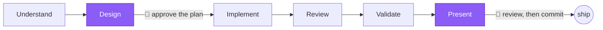

<div align="center">

# 🛠️ Himoa

### Production-grade engineering for coding agents — on any stack, in any repository.

```text
Understand → Design → Human approval → Implement → Review → Validate → Present
```

**Understand broadly enough to be right. Build only what the requirement needs.**
Evidence over assumption · risk-based rigor · explicit human approval · independent review.

<br/>

[](LICENSE)
[](#-supported-coding-agents)
[](#-what-it-does-not-do)
[](#-what-it-does-not-do)
[](#-what-ships)

<br/>

[**Agents**](#-supported-coding-agents) · [**Install**](#-install) · [**Workflow**](#-the-workflow) · [**Risk tiers**](#-risk-decides-the-rigor) · [**Approval**](#-human-approval) · [**Docs**](#-documentation)

</div>

---

## What Himoa is

**Himoa is one engineering methodology that runs inside your coding agent.** It
gives an AI agent the discipline of a senior engineer: understand the repository
before changing it, design before building, **stop for human approval**, implement
only what the requirement needs, review independently, validate with real
evidence, and present honestly.

It is **not** a prompt pack and **not** tied to one tool. The methodology is
canonical and lives in one place; each supported agent runs it through that
host's own native mechanisms. **Claude Code is the reference implementation**;
Codex, Cursor, GitHub Copilot and Gemini CLI are native adapters generated from
the same source — one methodology, no fork.

Two things work together, and they own different halves:

- **Himoa owns the methodology** — the workflow, risk model, evidence rules,
  review and validation discipline, and the human-approval boundary.
- **Your repository owns the truth** — what the system is, how it's built, how
  it's verified. That lives in your repo's **`AGENTS.md`** (see
  [below](#where-your-repositorys-truth-lives)). Agents cite your code or say
  `UNKNOWN`; they never guess your stack or invent an architecture you don't have.



> The pipeline runs on its own and **stops exactly twice** — to approve the
> plan, and to review the diff before you commit. Everything else runs without
> asking, at the rigor the change's risk earns.

---

## 🌐 Supported coding agents

The methodology is identical everywhere. What differs is how strongly each host
can *enforce* a given guarantee — Himoa states that honestly rather than
implying parity.

| Agent | Support | What that means |
|---|---|---|
| **Claude Code** | **Reference — full** | Production-proven. Native plugin, gates, read-only review subagents, always-on charter. |
| **OpenAI Codex** | **Supported (initial adapter)** | Native `SKILL.md` skills, read-only sandbox subagents, `AGENTS.md`. Structurally validated; live end-to-end run pending. |
| **Cursor** | **Supported (initial adapter)** | Native `SKILL.md`/`AGENTS.md`, `readonly` reviewer subagents. Shares its install with Codex. |
| **Gemini CLI** | **Supported (initial adapter)** | Reuses `AGENTS.md`, read-only reviewer subagents, `/himoa:*` slash commands. |
| **GitHub Copilot** | **Supported with limitations** | Repo-committed `AGENTS.md`; human approval is **hard** (PR review). Reviewer lenses are **advisory** (no read-only subagent); no skills mechanism. |

"Compatible in theory" is not "supported" — a host is listed only once its
adapter runs the methodology, and enforcement is never rounded up. Details:
[platform capabilities](docs/platform-capabilities.md) ·
[cross-agent architecture](docs/cross-agent-architecture.md).

---

## 📦 Install

Pick your agent. Every path installs the **same methodology**; only the
mechanism is host-native. Nothing here writes outside the paths shown, and
nothing commits on your behalf.

### Claude Code — the reference implementation

Installed as a plugin (once per machine), then declared in the repository (once
per repo, by one person, committed):

```text
# once per machine
/plugin marketplace add jaylordibe/himoa
/plugin install himoa@jaylordibe          # restart Claude Code after

# once per repository (writes AGENTS.md + a thin CLAUDE.md, and .claude/settings.json)
/himoa:framework-install
/himoa:framework-doctor                   # verify
```

Teammates who pull the repo only run the two `/plugin` lines on their own
machine — the plugin never travels with `git pull`. Every `/himoa:` command is
human-typed; the model cannot invoke or fake one.

### Codex, Cursor & Gemini CLI

These share one installer family. Get the `himoa-*` bins from the Claude plugin
(they're on your `PATH` once it's installed) **or** from a clone of this repo
(`git clone https://github.com/jaylordibe/himoa && himoa/plugins/himoa/bin/himoa-<host>-install`):

```bash
himoa-codex-install          # Codex   — machine: skills + read-only reviewers + standards
himoa-cursor-install         # Cursor  — shares the skills/standards install with Codex
himoa-gemini-install         # Gemini  — ~/.gemini subagents + /himoa:* commands
himoa-codex-install --repo   # once per repository: create/extend AGENTS.md (never destroys it)
himoa-codex-doctor           # verify  (himoa-{cursor,gemini}-doctor per host)
```

`--check` is a dry run; `--uninstall` removes only Himoa-owned files. Skills are
invoked by name (`himoa-work-item`, `himoa-gate-design`…); reviewer roles run
read-only; gates cannot be self-started by the model.

### GitHub Copilot

Copilot is a cloud agent, so its adapter is **repository-committed only** (it
never touches `$HOME`):

```bash
himoa-copilot-install        # writes ./AGENTS.md + advisory .github/agents/*.agent.md
himoa-copilot-doctor         # verify
git add AGENTS.md .github/agents && git commit   # then let Copilot open a PR
```

Human approval on Copilot is enforced structurally by GitHub (a human reviews
and merges the PR); the projected reviewer lenses are **advisory**, not
sandbox-enforced.

### Where your repository's truth lives

Repository-specific facts live in one neutral file — **`AGENTS.md`** at the repo
root — read by every agent. Claude Code reads it through a thin `CLAUDE.md` that
imports it (`@AGENTS.md`); Codex, Cursor, Copilot and Gemini read it directly.
State the truth once, there:

- what the system is (language, runtime, frameworks, data stores)
- **canonical commands** (build, lint, type-check, test) — the validation gate runs these
- **high-risk paths** that deserve extra ceremony
- **consumers** of your contracts
- deployment constraints and repository conventions

Himoa never invents a missing fact. An absent section is honest; a wrong one is
load-bearing misinformation. `framework-install` (Claude) and
`himoa-<host>-install --repo` scaffold it; fill it from repository evidence.
Full guide: [consuming repository guide](docs/consuming-repository-guide.md).

---

## ⚡ The workflow

Feed Himoa a requirement and it runs the whole lifecycle, stopping only at the
two human boundaries. On Claude Code:

```text
/himoa:work-item <requirement, issue key, or issue URL>
```

Other hosts invoke the same skill by name (Codex `$himoa-work-item`, Gemini
`/himoa:work-item`, Cursor `himoa-work-item`).

Need the ticket first? `write-ticket` drafts one the way a business analyst
would — a story, current behaviour cited from your code, observable acceptance
criteria, non-goals and open questions — and contains no design; the workflow
derives that from evidence, with approval.

<details>
<summary>Drive the stages yourself, or pick up ad-hoc work</summary>

```text
/himoa:gate-design <requirement>   →  /himoa:gate-approve  →  /himoa:gate-implement
/himoa:gate-review                 →  /himoa:gate-validate
```

Implemented something by hand? Pick up the back half: `gate-review`, then
`gate-validate`.
</details>

> **Small changes skip all of this.** A comment fix, a rename in one file, a log
> line, a one-liner — Himoa makes the edit and stops. No plan, no review panel,
> no report.

---

## 🎚️ Risk decides the rigor

Ceremony scales with what a change can break — a copy fix stays cheap, a schema
change gets everything it needs. This is agent-independent.

| Tier | Examples | You get |
|---|---|---|
| **Below Low** | Comment fix, rename in one file, log line, one-liner | The edit. Nothing else. |
| **Low** | Copy, isolated rename, test-only cleanup | No plan document |
| **Medium** | Business logic, endpoint behaviour | A plan |
| **High** | Auth, tenancy, personal data, money, uploads, webhooks, migrations, public contracts, concurrency | Full plan, threat model, negative tests, multi-lens review |
| **Critical** | Identity infrastructure, cryptography, privileged access, destructive data work | All of High, plus human security review |

On a boundary between two tiers you get the higher one; a change touching a
**High-risk path** you declared in `AGENTS.md` is raised automatically. Asking to
keep a change cheap is decisive below Low; above it, it buys a shorter report and
fewer speculative searches — **never** fewer tests, reviewers or checks.

**Investigate deeply, build minimally.** Investigation breadth and
implementation breadth are independent: a High-risk change may earn a deep map,
a threat model and a full review panel and still ship as a five-line diff. Before
adding an abstraction, a dependency or a new path, Himoa reuses what the
repository already owns and prefers the standard library and platform over new
code. Policy: [`execution-efficiency`](plugins/himoa/standards/execution-efficiency.md)
· [`architecture`](plugins/himoa/standards/architecture.md) §3.

---

## 🧑 Human approval

Himoa stops for a human at two boundaries, and the stop is not a formality:

1. **After design, before implementation.** The plan is presented and Himoa
   waits. Silence is not approval, task assignment is not approval, a permissive
   sandbox is not approval, and a prior approval never covers a materially changed
   design.
2. **After validation, before you commit.** Himoa prepares the diff, tests and
   evidence and hands off. It never commits, pushes, merges, deploys or applies a
   migration — the act of record stays yours.

How the *first* stop is enforced per host: **native** on Claude Code and Cursor
(gate skills are not model-invocable) and Codex (`allow_implicit_invocation:
false`); on Gemini a gate is a human-typed command; on **Copilot it is hard** —
GitHub requires a human to review and merge the PR. Himoa reports which of these
applies rather than assuming they are equivalent.

---

## 🔤 Evidence language

Every claim Himoa makes carries one of these — and never rounds up.

| Verdict | Meaning |
|---|---|
| `PASS` | The check ran and passed for the stated scope |
| `FAIL` | It ran and failed |
| `BLOCKED` | It could not run |
| `N/A` | Your repository has no such step — does not block an overall `PASS` |

Skipped, partial, filtered or flaky is **never** `PASS`. Making a check green by
weakening the check — deleting a test, gutting an assertion, lowering a
threshold, suppressing a finding — is manufacturing a pass, not passing.

---

## What ships & what it does not do

### 📦 What ships

The **Claude Code reference implementation**: 13 skills (`work-item`,
`write-ticket`, five gates, `framework-install`/`framework-doctor`, four domain
playbooks), 8 read-only review agents (`context-mapper`, `architect`,
`reviewer`, `security`, `tester`, `contract`, `data`, `performance`), and one
`SessionStart` charter that carries the always-on rules and gates nothing. The
**Codex, Cursor, Copilot and Gemini adapters** are generated from that same
source (no fork, drift-checked in CI) into each host's native format and
installed by `himoa-<host>-install`. No build step, no runtime dependencies, no
published artifact.

### 🚫 Security boundaries

- **No permission rules, no command-gating hooks.** Prompting and blocking are
  governed entirely by *your* settings and permission mode — Himoa ships neither.
- **Repository installs write a bounded set only.** `framework-install` merges
  exactly three keys into your project's `.claude/settings.json`
  (`extraKnownMarketplaces`, `enabledPlugins`, `env.CLAUDE_CODE_ENABLE_TODO_TOOLS`)
  — never `permissions`, never `hooks`. The `himoa-<host>-install` bins write only
  Himoa-owned, prefixed paths, are idempotent, and never overwrite unrelated files
  or destroy an existing `AGENTS.md`.
- **The act of record stays yours.** Himoa never commits, pushes, deploys or
  applies migrations.

Rationale: [architecture](docs/architecture.md).

---

## ⬆️ Update

On Claude Code, auto-update is on by default — the new version loads on your next
launch or after `/reload-plugins`. If you opted out
(`framework-install --no-auto-update`): `/plugin marketplace update jaylordibe`
then `/plugin update himoa@jaylordibe`, and restart. On a **major** version bump
read the [CHANGELOG](CHANGELOG.md) first; minor and patch bumps never ask
anything of you. For the other hosts, re-run `himoa-<host>-install` to refresh;
`himoa-<host>-doctor` reports a stale install.

---

## 🩺 Troubleshooting

<details>
<summary>Common symptoms and fixes</summary>

| Symptom | Cause and fix |
|---|---|
| Skills / commands don't appear | Not installed, or the session predates the install. Re-check the [install](#-install) for your agent, then reload or restart. |
| Works for me, not for a teammate (Claude) | They need the per-machine `/plugin install`, not `framework-install`. The plugin doesn't travel with `git pull`. |
| `framework-doctor`: repository does not declare Himoa | Run `framework-install` (Claude) or `himoa-<host>-install --repo`, and commit the result. |
| Everything prompts for permission / a command is blocked | Not Himoa — it ships no permission rules. Check your own settings and permission mode. |
| An agent describes architecture you don't have | Your `AGENTS.md` is missing or stale. Fill it from evidence, run the doctor, then [open an issue](https://github.com/jaylordibe/himoa/issues) with the transcript. |
| The agent claims a gate ran (Claude) | It didn't — gates cannot be model-invoked. The claim is the bug. |
| A non-Claude host doesn't reflect the methodology | Confirm `himoa-<host>-doctor` is green, and that a live host run is expected — see [adapter smoke test](docs/adapter-smoke-test.md). |

</details>

---

## 📚 Documentation

| Document | For |
|---|---|
| [Consuming repository guide](docs/consuming-repository-guide.md) | Setting up a repository and filling `AGENTS.md` |
| [Cross-agent architecture](docs/cross-agent-architecture.md) | One methodology, native adapters — the core/adapter boundary |
| [Platform capabilities](docs/platform-capabilities.md) | What each agent can and cannot enforce, honestly |
| [Adapter smoke test](docs/adapter-smoke-test.md) | Producing the live end-to-end evidence per host |
| [Architecture](docs/architecture.md) | Why methodology and repository own different things |
| [Versioning](docs/versioning.md) · [Changelog](CHANGELOG.md) | What each release means and asks of you |
| [Development guide](docs/development-guide.md) · [Constraints](docs/constraints.md) | Changing/releasing Himoa; the host limits that shaped it |

---

<div align="center">

**MIT licensed.** Contributions welcome — see [CONTRIBUTING.md](CONTRIBUTING.md).

<sub>Himoa owns the methodology. Your repository owns the truth.</sub>

</div>
